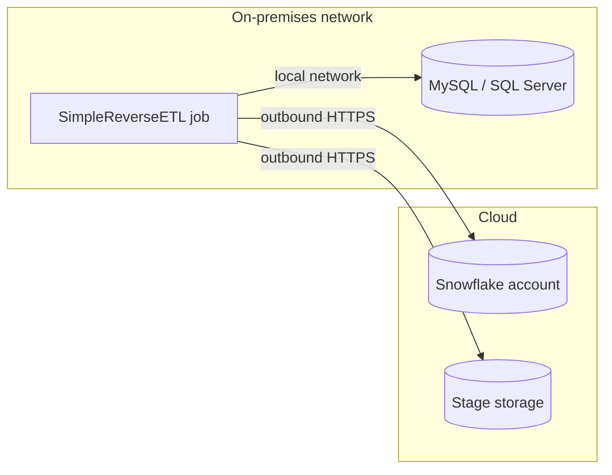

# SimpleReverseETL

[](LICENSE)
[](https://www.snowflake.com/)
[](https://www.python.org/)

SimpleReverseETL is a reference implementation for delivering data from Snowflake to
on-premises relational databases (MySQL and Microsoft SQL Server) using a lightweight
Python job that runs inside the on-premises network. It provides two data-movement
transports, incremental change capture, and idempotent upsert semantics, and is intended
as a starting point for teams that need to feed downstream operational or reporting
databases without introducing an additional integration platform.

## Contents

- [Architecture](#architecture)
- [Network and firewall requirements](#network-and-firewall-requirements)
- [Choosing a transport](#choosing-a-transport)
- [Change capture and write semantics](#change-capture-and-write-semantics)
  - [Stream-based change capture](#stream-based-change-capture)
- [Configuration](#configuration)
- [Usage](#usage)
- [Production considerations](#production-considerations)
- [Known limitations](#known-limitations)
- [Demo](#demo)
- [Repository layout](#repository-layout)
- [License](#license)
- [Disclaimer](#disclaimer)

## Architecture

The job is deployed on a host inside the on-premises network and **initiates every
connection itself**. It never listens for, or depends on, inbound connections from
Snowflake or any other cloud service. This matches the common enterprise posture in
which traffic from the internet into the data center is denied, while controlled
egress from approved hosts is permitted.



Two transports are provided. Both write to the same target tables with the same
change-capture and upsert options.

**Transport A — connector pull (`sync.py`).** The job queries Snowflake through the
Snowflake Connector for Python, consumes the result as Apache Arrow batches
(`fetch_pandas_batches`), and writes each batch to the target with batched parameterized
statements. Upserts use `INSERT ... ON DUPLICATE KEY UPDATE` on MySQL and a staging table
plus `MERGE` on SQL Server. Memory use is bounded by batch size rather than result size.

**Transport B — unload and bulk load (`unload_sync.py`).** The job issues
`COPY INTO <stage>` so that Snowflake writes the result as compressed CSV files, retrieves
the files, and loads them with the target database's native bulk loader
(`LOAD DATA LOCAL INFILE` on MySQL). The Snowflake session is only needed for the unload
and file retrieval; the load itself is decoupled from Snowflake and can be retried from
the retrieved files.

## Network and firewall requirements

This design removes the need for **inbound** connectivity into the on-premises network.
It does **not** remove the need for connectivity altogether: the on-premises host must be
permitted to make **outbound** connections to Snowflake, to the storage behind the stage,
or both, depending on the transport. If the host has no approved egress path, neither
transport will work without a change to network policy. Confirm this requirement with
your network and security teams before adopting the approach.

### Transport A, and Transport B as implemented in this repository

Both require outbound HTTPS from the job host to the Snowflake account. Note that the
account hostname alone is not sufficient:

| Endpoint | Port | Purpose |
|---|---|---|
| Account hostname (`<account>.snowflakecomputing.com`) | 443 | Authentication and query execution |
| Stage storage hosts (Snowflake-managed S3, Azure Blob, or GCS) | 443 | File transfer (`GET`/`PUT`) and retrieval of larger result sets |
| OCSP cache and responder hosts | 80 | TLS certificate revocation checks performed by the connector |

Obtain the authoritative list for your account with
[`SYSTEM$ALLOWLIST()`](https://docs.snowflake.com/en/sql-reference/functions/system_allowlist)
and validate connectivity from the job host with
[SnowCD](https://docs.snowflake.com/en/user-guide/snowcd), or with the connector's built-in
diagnostics (`enable_connection_diag=True`). Additional points:

- **Snowflake network policies.** If the account or service user is governed by a network
  policy, the public egress IP addresses of the job host (or its proxy/NAT) must be allowed.
- **Proxies.** The Snowflake Connector for Python 3.x/4.x honors the `HTTP_PROXY`,
  `HTTPS_PROXY`, and `NO_PROXY` environment variables; `NO_PROXY` can route stage storage
  traffic (for example `.amazonaws.com`) around the proxy.
- **TLS inspection.** Snowflake does not support proxies that re-sign TLS traffic. Where an
  inspecting proxy is in the path, configure it to pass Snowflake and stage-storage traffic
  through unmodified.
- **Private connectivity.** Where egress over the public internet is not permitted, AWS
  PrivateLink, Azure Private Link, or Google Cloud Private Service Connect can carry this
  traffic over a private path. Use
  [`SYSTEM$ALLOWLIST_PRIVATELINK()`](https://docs.snowflake.com/en/sql-reference/functions/system_allowlist_privatelink)
  for the corresponding host list.
- **Connector versions.** This implementation is validated with connector 4.x. The
  [5.x connector](https://docs.snowflake.com/en/developer-guide/python-connector/python-connector-universal-core)
  (currently in preview) reads proxy environment variables only when `use_proxy_env=True`
  is set, and replaces OCSP checks with optional CRL checks, which changes the endpoints
  above. Pin the connector version in production and review these items before upgrading.

As implemented here, Transport B unloads to the Snowflake user stage and retrieves files
with `GET`, so its connectivity requirements are the same as Transport A's.

### Transport B with an external stage

In production, Transport B is typically configured against an **external stage** backed
by object storage (Amazon S3, Azure Blob Storage, or Google Cloud Storage). This changes
the connectivity profile:

- Snowflake writes to the bucket through a
  [storage integration](https://docs.snowflake.com/en/sql-reference/sql/create-storage-integration);
  the on-premises host reads from the bucket with its **own** credentials (for example an
  IAM role or user, a SAS token, or a service principal) using the cloud provider's SDK or
  CLI. `GET` is not supported for external stages.
- The job host therefore requires outbound HTTPS to the **object storage endpoint**, and the
  bucket policy must permit access from the job host's identity and network location.
- If the unload is issued by the job, the host still requires connectivity to Snowflake for
  the `COPY INTO` statement. If the unload is instead scheduled inside Snowflake (for
  example with a [task](https://docs.snowflake.com/en/user-guide/tasks-intro)), the job
  host needs **only** bucket access and no direct Snowflake connectivity. This variant is
  often the easiest to approve, but it requires a way for the job to detect newly
  unloaded files and is not implemented in this repository.

| Deployment | Job host needs outbound access to |
|---|---|
| Transport A | Snowflake account, stage storage, OCSP |
| Transport B, internal stage (this repository) | Snowflake account, stage storage, OCSP |
| Transport B, external stage, unload issued by the job | Snowflake account and OCSP (for `COPY INTO`), plus the customer bucket |
| Transport B, external stage, unload scheduled in Snowflake | The customer bucket only |

## Choosing a transport

| Consideration | Transport A — connector pull | Transport B — unload and bulk load |
|---|---|---|
| Components | Job, Snowflake, target | Job, Snowflake, stage storage, target |
| Suitable volumes | Incremental deltas and moderate tables | Large full or incremental loads (tens of millions of rows) |
| Load mechanism | Batched parameterized DML | Native bulk load |
| Snowflake session | Used for the duration of the load | Used only for unload and retrieval |
| Recovery | Re-query the source | Re-load from retrieved files |
| Change capture | `none`, `hwm`, `stream` | `none`, `hwm` |
| Targets | MySQL, SQL Server | MySQL (SQL Server bulk load not implemented) |

Transport A is the simpler option and is well suited to scheduled delta synchronization.
Transport B is preferable when full reloads or large deltas make row-level DML the
bottleneck, and is the natural fit when an object-storage hand-off is the approved
integration pattern.

## Change capture and write semantics

**Change capture** (`--change-capture`) determines which rows are sent:

- `none` — the full source on every run. Typically combined with `--mode truncate`.
- `hwm` — rows whose monotonic high-water-mark column (for example `UPDATED_AT`) is greater
  than the last delivered value (the watermark). Each run reads `MAX(col)` as a ceiling
  before extraction, loads the rows between the watermark and the ceiling, and records the
  ceiling as the new watermark only after the target commit succeeds, so a failed run is
  safely retried. The watermark is stored in a JSON file on the job host (`--state-file`,
  default `./sync_state.json`), keyed by source table. On the first run, `--hwm-start`
  sets the starting point; without it, all existing rows are loaded. Keep the state file
  on durable storage in production, or replace `_load_state`/`_save_state` with a control
  table or scheduler variable.
- `stream` — Transport A only. Uses a Snowflake stream instead of a watermark column, and
  also propagates deletes. See [Stream-based change capture](#stream-based-change-capture).

**Choosing `hwm` or `stream`.**

| Consideration | `hwm` | `stream` |
|---|---|---|
| Source requirement | A reliable, monotonically increasing column such as `UPDATED_AT` | None; change tracking is enabled on the table |
| Inserts and updates | Yes | Yes |
| Deletes | No; deleted rows remain in the target | Yes |
| Position stored in | JSON state file on the job host | Stream offset and outbox table in Snowflake |
| Snowflake objects to create | None | Stream and outbox table |
| Transports | A and B | A only |
| Operational risk | Rows updated without changing the column are missed | Stream becomes stale if not consumed within the retention period |

### Stream-based change capture

A Snowflake [stream](https://docs.snowflake.com/en/user-guide/streams-intro) records the
inserts, updates, and deletes committed to a table after a point in time (its offset).
Selecting from a stream does not change the offset; the offset advances only when the
stream is read by a DML statement that commits. The job uses this to make delivery
reliable across two systems that cannot share a transaction:

1. **Consume.** `INSERT INTO <outbox> SELECT ... FROM <stream>` copies all pending changes
   into an outbox table in Snowflake, together with the change type, an update flag, and a
   load timestamp. Committing this statement advances the stream offset; the changes are
   now held in the outbox.
2. **Reduce.** The job reads every outbox row not yet marked exported. A stream represents
   an update as two rows: a `DELETE` with the old values and an `INSERT` with the new
   values, both with `METADATA$ISUPDATE = TRUE`. The job discards the old-value rows and
   keeps only the most recent change for each key, so the outbox can safely hold the
   changes from several consumes.
3. **Apply.** Remaining inserts are upserted on `--key-cols`, and plain deletes are deleted
   by key, in one target transaction.
4. **Acknowledge.** After the target commit, the job marks the outbox rows exported.

If the job fails after step 1, the changes stay in the outbox and are applied on the next
run. If it fails after step 3 but before step 4, they are applied again. Upserts and
deletes by key are idempotent, so delivery is at-least-once with a correct final state.

**Setup.** Run once, as described in [sql/01_snowflake_setup.sql](sql/01_snowflake_setup.sql):

- Enable change tracking on the source table. Only the table owner can do this; creating
  a stream also enables it if the creating role owns the table.
- Create a stream on the source table. Use a standard stream; an append-only stream does
  not report updates or deletes.
- Create the outbox table with the source columns **in the same order**, followed by
  `_CDC_ACTION`, `_CDC_ISUPDATE`, `_CDC_LOADED_AT`, and `_CDC_EXPORTED`. The consume
  statement inserts by position.
- Perform an initial full load (`--change-capture none --mode truncate`) after creating the
  stream. Changes recorded between stream creation and the full load are applied again on
  the first stream run, which is harmless.

**Privileges.** The job's role needs `USAGE` on the database and schema, `SELECT` on both
the stream and its source table, and `SELECT`, `INSERT`, and `UPDATE` on the outbox.

**Operational notes.**

- *Staleness.* A stream becomes stale if it is not consumed within the source table's data
  retention period, extended up to `MAX_DATA_EXTENSION_TIME_IN_DAYS` (14 days by default).
  A stale stream cannot be read; it must be recreated and the target fully reloaded.
  Monitor `STALE_AFTER` in `SHOW STREAMS` and schedule runs well inside that window.
- *Recreating the source.* Replacing the source table (`CREATE OR REPLACE TABLE`) breaks
  the stream. Recreate the stream and perform a full load.
- *Outbox growth.* Exported rows remain in the outbox as an audit trail. Purge them on a
  schedule, for example `DELETE FROM <outbox> WHERE _CDC_EXPORTED AND _CDC_LOADED_AT <
  DATEADD('day', -7, CURRENT_TIMESTAMP())`.
- *Volume.* All pending outbox rows are reduced in memory in one pass. This suits regular
  deltas; for a large backlog, perform a full load and recreate the stream instead.
- *Alternative.* The `CHANGES` clause reads change-tracking data between two timestamps
  without a stream or outbox. Its position must then be tracked by the job, as with `hwm`.
  An example is included in `sql/01_snowflake_setup.sql`; it is not implemented in the job.

### Write modes

`--mode truncate` replaces the target contents; `--mode upsert` merges on
`--key-cols`, which must correspond to a primary or unique key on the target.

**NULL handling (Transport B).** SQL `NULL` values are unloaded as an explicit sentinel and
converted back to `NULL` during the bulk load, so `NULL` and empty strings remain distinct
through the round trip.

## Configuration

Configuration is read from environment variables; [.env.example](.env.example) provides a
template. Load the file into the environment before running a job
(for example `set -a; source .env; set +a`) or supply the variables from your scheduler
or secret store.

| Variable | Description |
|---|---|
| `SF_CONNECTION_NAME` | Named entry in `~/.snowflake/connections.toml`. When set, account, user, and credentials are taken from that entry. |
| `SF_ACCOUNT`, `SF_USER` | Account identifier and user, when not using a named connection. |
| `SF_AUTH_METHOD` | `keypair` or `pat`. |
| `SF_PRIVATE_KEY_PATH`, `SF_PRIVATE_KEY_PASSPHRASE` | PKCS#8 private key for key-pair authentication. |
| `SF_PAT` | Programmatic access token. |
| `SF_ROLE`, `SF_WAREHOUSE`, `SF_DATABASE`, `SF_SCHEMA` | Session context, applied on top of either method. |
| `TARGET_KIND` | `mysql` or `mssql`. |
| `TARGET_HOST`, `TARGET_PORT`, `TARGET_DATABASE`, `TARGET_USER`, `TARGET_PASSWORD` | Target database connection. |
| `TARGET_ODBC_DRIVER` | ODBC driver name for SQL Server (default `ODBC Driver 18 for SQL Server`). |
| `LOG_LEVEL` | Python logging level (default `INFO`). |

**Authentication.** For unattended execution, use
[key-pair authentication](https://docs.snowflake.com/en/user-guide/key-pair-auth) with a
dedicated service user. Programmatic access tokens are supported for evaluation and
short-lived use.

## Usage

Install dependencies (the SQL Server driver additionally requires the Microsoft ODBC
Driver for SQL Server at the operating-system level):

```bash
python3 -m venv .venv && source .venv/bin/activate
pip install -r requirements.txt
```

Transport A:

```bash
# Full refresh
python sync.py --source ANALYTICS.DENTAL.DENTAL_CLAIMS --target DENTAL_CLAIMS \
    --change-capture none --mode truncate

# Incremental upsert on a high-water-mark column
python sync.py --source ANALYTICS.DENTAL.DENTAL_CLAIMS --target DENTAL_CLAIMS \
    --change-capture hwm --hwm-col UPDATED_AT --mode upsert --key-cols CLAIM_ID

# Stream-based change capture, including deletes
python sync.py --source ANALYTICS.DENTAL.DENTAL_CLAIMS --target DENTAL_CLAIMS \
    --change-capture stream --stream ANALYTICS.DENTAL.CLAIMS_STREAM \
    --outbox ANALYTICS.DENTAL.CLAIMS_OUTBOX --mode upsert --key-cols CLAIM_ID
```

Transport B:

```bash
# Incremental upsert via unload and bulk load
python unload_sync.py --source ANALYTICS.DENTAL.DENTAL_CLAIMS --target DENTAL_CLAIMS \
    --change-capture hwm --hwm-col UPDATED_AT --mode upsert --key-cols CLAIM_ID \
    --stage @~/simple_reverse_etl --local-dir /var/lib/simple-reverse-etl/unload
```

Both commands exit non-zero on failure, roll back the target transaction, and leave the
watermark or outbox state unchanged. Run `--help` on either script for the full option
list.

## Production considerations

- **Service identity and privileges.** Run under a dedicated service user and role granted
  the minimum required: `USAGE` on the warehouse, database, and schema and `SELECT` on the
  source; for stream mode, `SELECT` on the stream and its source table and `INSERT`,
  `SELECT`, and `UPDATE` on the
  outbox; for Transport B with a named stage, the appropriate stage privileges.
- **Secrets.** Do not deploy a populated `.env` file. Supply credentials from an approved
  secret store and prefer key-pair authentication over passwords or long-lived tokens.
- **Scheduling.** The job has no scheduler of its own. Invoke it from the orchestrator
  already in use (cron, Airflow, Control-M, and so on). Runs for a given target should not
  overlap.
- **Target schema.** Target tables must exist before the first run, with column names
  matching the source projection and a key that supports the chosen upsert.
- **Volume.** Prefer incremental change capture over full reloads, and prefer Transport B
  where row-level DML becomes the bottleneck. Transport A read throughput can be increased
  further with `cursor.get_result_batches()` for parallel retrieval.
- **Stream retention.** In stream mode, schedule runs well inside the stream's
  `STALE_AFTER` window; see [Stream-based change capture](#stream-based-change-capture).

## Known limitations

- SQL Server bulk load for Transport B is not implemented; the method documents a
  `BULK INSERT` / `bcp` approach. Transport A supports SQL Server fully.
- Transport B supports `none` and `hwm` change capture; stream-based change capture is
  available only through Transport A.
- Retrieval from external stages (cloud SDK instead of `GET`) and Snowflake-scheduled
  unloads are described above but not implemented.
- Schema evolution is not managed; source and target structures must be kept aligned.

## Demo

A self-contained demonstration runs both transports against a Snowflake table and a local
MySQL instance in Docker, performs a full load and an incremental upsert with each, and
verifies that both produce identical results. See [demo/README.md](demo/README.md).

## Repository layout

```
config.py             Environment-based configuration for Snowflake and the target
snowflake_source.py   Connection, Arrow batch reads, unload and GET, stream helpers
targets.py            MySQL and SQL Server writers (upsert, bulk load)
sync.py               Transport A command-line entry point
unload_sync.py        Transport B command-line entry point
sql/                  One-time Snowflake setup for stream-based change capture
demo/                 Docker and Snowflake demonstration of both transports
```

## License

Released under the MIT License; see [LICENSE](LICENSE). Third-party components and their
licenses are listed in [NOTICE](NOTICE). Contributions are not accepted; see
[CONTRIBUTING.md](CONTRIBUTING.md). To report a security issue, see
[SECURITY.md](SECURITY.md).

## Disclaimer

This software is provided "as is", without warranty of any kind, express or implied.

This is not an official Snowflake product or offering. It is an independent reference
implementation built on documented Snowflake features and is not endorsed, supported, or
maintained by Snowflake Inc. Running it consumes compute in your Snowflake account. Use it
at your own risk.
