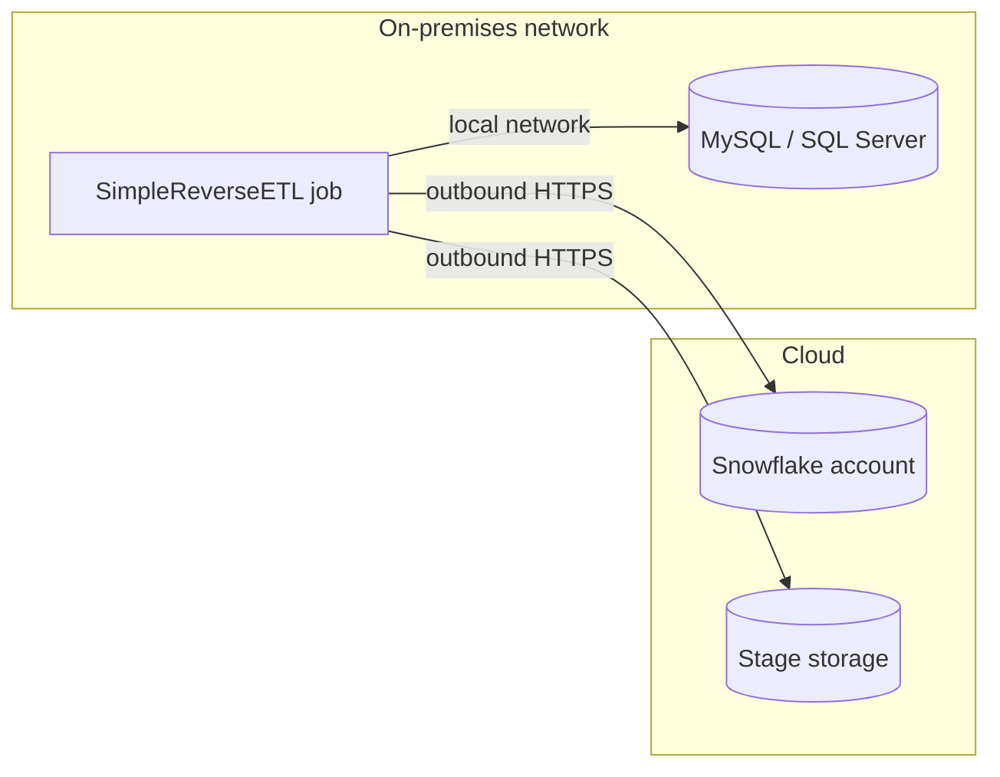

# SimpleReverseETL

[](LICENSE)
[](https://www.snowflake.com/)
[](https://www.python.org/)

SimpleReverseETL is a reference implementation for delivering data from Snowflake to
on-premises relational databases (MySQL and Microsoft SQL Server) using a lightweight
Python job that runs inside the on-premises network. It provides two data-movement
transports, incremental change capture, and idempotent upsert semantics, and is intended
as a starting point for teams that need to feed downstream operational or reporting
databases without introducing an additional integration platform.

## Contents

- [Architecture](#architecture)
- [Network and firewall requirements](#network-and-firewall-requirements)
- [Choosing a transport](#choosing-a-transport)
- [Change capture and write semantics](#change-capture-and-write-semantics)
  - [Stream-based change capture](#stream-based-change-capture)
  - [Key requirements](#key-requirements)
  - [Data types](#data-types)
- [Configuration](#configuration)
- [Usage](#usage)
- [Failure handling and recovery](#failure-handling-and-recovery)
- [Operations](#operations)
- [Security](#security)
- [Performance](#performance)
- [Production considerations](#production-considerations)
- [Tested versions](#tested-versions)
- [Known limitations](#known-limitations)
- [Demo](#demo)
- [Repository layout](#repository-layout)
- [License](#license)
- [Disclaimer](#disclaimer)

## Architecture

The job is deployed on a host inside the on-premises network and **initiates every
connection itself**. It never listens for, or depends on, inbound connections from
Snowflake or any other cloud service. This matches the common enterprise posture in
which traffic from the internet into the data center is denied, while controlled
egress from approved hosts is permitted.



A single job, `sync.py`, combines a change-capture mode (`--change-capture`: which rows
to send) with one of two transports (`--transport`: how they move). Every change-capture
mode works with both transports, and both transports write to the same target tables with
the same write modes.

**Transport A — connector pull (`--transport pull`, the default).** The job queries
Snowflake through the Snowflake Connector for Python, consumes the result as Apache Arrow
batches (`fetch_pandas_batches`), and writes each batch to the target with batched
parameterized statements. Upserts use `INSERT ... ON DUPLICATE KEY UPDATE` on MySQL and a
session temporary table plus `MERGE` on SQL Server. Memory use is bounded by batch size
rather than result size.

**Transport B — unload and bulk load (`--transport unload`).** The job issues
`COPY INTO <stage>` so that Snowflake writes the result as compressed CSV files, retrieves
the files, and loads them with the target database's native bulk loader
(`LOAD DATA LOCAL INFILE` on MySQL, `BULK INSERT` on SQL Server). Snowflake does the
extraction in parallel, and the target load reads local files rather than a live result
set. Each run first empties the stage path for the target and then unloads with
`INCLUDE_QUERY_ID = TRUE`, which the documentation recommends over `OVERWRITE = TRUE`
because after an internal retry "Snowflake deletes the partial set of unloaded files"
([COPY INTO \<location\>](https://docs.snowflake.com/en/sql-reference/sql/copy-into-location)).
After a successful run the job deletes this target's files from the stage and from
`--local-dir`, so no copy of the data stays behind (`--keep-files` keeps them). After a
failed run they are kept, so a failed load can be inspected; a rerun unloads again. Each
run empties `--local-dir` first, so give each target its own folder if runs for
different targets can overlap.

The code follows the same split: [change_capture.py](change_capture.py) builds a plan of
what to send, [transports.py](transports.py) moves it, [targets.py](targets.py) writes to
MySQL or SQL Server, and [sync.py](sync.py) commits the target and then records progress.

## Failure handling and recovery

The job has no internal retry. A failed run leaves the target and the recorded progress
in a state from which the next scheduled run (or a manual rerun) continues correctly, and
reports what happened through its exit code.

| Exit code | Meaning | Target | Progress (watermark or outbox) | Action |
|---|---|---|---|---|
| 0 | Success, or nothing to send | Committed | Advanced | None |
| 1 | The run failed | Rolled back (see the exceptions below) | Unchanged | Rerun after fixing the cause |
| 2 | Invalid options | Untouched; nothing connected | Unchanged | Fix the command line |
| 3 | Another run for the same target holds the lock | Untouched | Unchanged | None; the next run proceeds |
| 4 | The target committed, but saving progress failed | Committed | Not advanced | Rerun; it re-sends the same rows |

Exceptions to "rolled back": Transport A with `none` or `hwm` keeps the batches committed
before the failure (`--commit-rows`), and on MySQL `TRUNCATE TABLE` causes an implicit
commit, so a failed full load can leave the table empty or partly loaded. In both cases
the rerun completes the load (tested).

**What was tested.** [demo/verify_recovery.py](demo/verify_recovery.py) runs every
combination of change capture and write mode (`none`/`truncate`, `hwm`/`upsert`,
`stream`/`upsert`) with both transports, and injects each of these
failures in turn:

- the Snowflake read or unload fails
- the target write fails part-way (after some rows are written)
- the target commit fails
- saving the watermark or acknowledging the outbox fails after the target committed
- the process is killed (no rollback, no clean disconnect) right after a write

Before the failure the source receives inserts, an update, and, where the mode can see
them, a delete and an `UPDATE` that changes the key value. After each failure the job is
run twice more without a failure, and the target is compared with Snowflake. On MySQL 8.4,
SQL Server 2022 with `bulk_insert`, and SQL Server 2022 with `client`, all 28 applicable
scenarios ended with the target matching the source, the failed run exiting non-zero, and
both later runs exiting 0. An earlier version of the job also accepted `hwm` with
`--mode append`; in the same tests two or three rows were delivered twice after a
Transport A partial commit or a progress-save failure, so that combination is now
rejected.

**Runbook.**

- *A run failed (exit 1).* Read the logged error, fix the cause, and rerun. No cleanup is
  needed. For Transport B the failed run's files are on the stage and in `--local-dir`;
  the next run deletes them before it unloads.
- *Progress was not saved (exit 4).* Rerun. The rows are sent again and upserted, so the
  result is unchanged.
- *The run reported the lock (exit 3) unexpectedly.* Another run is active for the same
  target, possibly still in progress from an earlier schedule. The lock belongs to that
  run's database session and is released when it ends, including when the process is
  killed and the connection drops (tested).
- *Reload a target from scratch.* For `hwm`, remove the target's entry from the state file
  (or the file) and run with `--mode upsert`, or run a full load
  (`--change-capture none --mode truncate`) first. For `stream`, run a full load; pending
  outbox changes are then applied again on the next stream run, which is harmless.
- *The stream is stale or the source table was replaced.* Recreate the stream, run a full
  load, and resume stream runs (see
  [Stream-based change capture](#stream-based-change-capture)).

## Operations

- **One run per target at a time.** At start the job takes a lock named after
  `--target` in the target database (MySQL `GET_LOCK`, SQL Server `sp_getapplock` owned by
  the session) and exits with code 3 if another run holds it. Both are released when the
  session ends. The lock does not cover a shared `--local-dir`: give each target its own
  folder.
- **Run summary.** Each run logs one line beginning `RUN_SUMMARY` followed by JSON with
  the status (`ok`, `no_changes`, `failed`, `locked`, `state_not_saved`), source, target,
  change capture, transport, mode, rows written and deleted, and duration. Collect it with
  the scheduler's logs to alert on failures and track volumes.
- **Query tag.** The job's Snowflake session sets `QUERY_TAG` to
  `simple-reverse-etl:<target>`, so its queries and their warehouse time can be found in
  query history.
- **Timeouts.** By default nothing times out. `SF_STATEMENT_TIMEOUT_SECONDS` sets the
  session's `STATEMENT_TIMEOUT_IN_SECONDS` (tested: a longer statement is cancelled with
  "Statement reached its statement or warehouse timeout"). `TARGET_STATEMENT_TIMEOUT_SECONDS`
  sets the MySQL client read and write timeouts or the `pyodbc` query timeout for SQL
  Server. Set them above the longest expected statement; a timeout fails the run (exit 1).
  The Python connector's own `network_timeout` is "By default, none/infinite"
  ([connector API](https://docs.snowflake.com/en/developer-guide/python-connector/python-connector-api)).
- **Monitoring.** Alert on non-zero exit codes. In stream mode also watch `STALE_AFTER`
  (`SHOW STREAMS`) and the number of un-exported outbox rows
  (`SELECT COUNT_IF(NOT _CDC_EXPORTED) FROM <outbox>`), which grows when runs fail.
- **Many tables.** Run one job per table. Tables are synchronized independently and at
  different times, so foreign keys between target tables can be violated between runs;
  load parent tables first, or do not enforce those foreign keys on the target.
- **Schema changes.** The job selects `SELECT * FROM <source>`. Adding a source column
  makes runs fail (exit 1, tested on both targets) until the target has the column; dropping or renaming one requires the
  same change on the target. A view as `--source` (tested with `none` and `hwm`) pins the
  projection so that source changes do not reach the target unplanned.

## Security

- **Credentials.** Use key-pair authentication for the Snowflake service user, and supply
  credentials from a secret store rather than a file on the job host.
- **Snowflake privileges.** The job's role needs `USAGE` on the warehouse, database, and
  schema and `SELECT` on the source (for a view, "the SELECT privilege is not required on
  the objects from which the view is created"). Stream mode also needs `SELECT` on the
  stream and `SELECT`, `INSERT`, `UPDATE`, and `DELETE` on the outbox. Transport B with an
  internal stage needs `WRITE` ("PUT, REMOVE, COPY INTO <location>") and `READ` ("GET,
  LIST") on the stage ([privileges](https://docs.snowflake.com/en/user-guide/security-access-control-privileges)).
  The demo ran with an administrative role; these grants are taken from the documentation
  and were not tested with a least-privilege role.
- **Governance policies carry through.** For unloads the documentation states: "If a
  masking policy is set on a column, the masking policy is applied to the data resulting
  in unauthorized users seeing masked data in the column"
  ([COPY INTO \<location\>](https://docs.snowflake.com/en/sql-reference/sql/copy-into-location)).
  The job receives what its role is allowed to see, so masked values are what reach the
  target. Grant the job's role access deliberately.
- **Data at rest.** Files on an internal stage are "client-side encrypted by
  default"; files downloaded by `GET` are written with permissions `600` by default. The
  decompressed CSV files in `--local-dir` are plain text. They are deleted after a
  successful run (tested), but remain after a failed run or with `--keep-files`. Put
  `--local-dir` on an encrypted volume readable only by the job (and, for
  `bulk_insert`, by the SQL Server service account).
- **Connections to the target.** SQL Server connections are encrypted and the certificate
  is verified by default (`TARGET_MSSQL_ENCRYPT`, `TARGET_MSSQL_TRUST_SERVER_CERT`).
  MySQL connections require a verified server certificate: set `TARGET_MYSQL_SSL_CA` to
  the CA that issued it, or the job refuses to connect. Tested: without a CA the job
  refused to connect, the server's CA was accepted, and an unrelated CA was rejected.
  Host-name checking (`TARGET_MYSQL_SSL_VERIFY_IDENTITY`, default `yes`) requires a
  certificate issued for the host name used in `TARGET_HOST`.
  `TARGET_MYSQL_SSL_VERIFY=no` turns verification off and logs a warning. PyMySQL then
  still negotiated TLS with the test server (`Ssl_cipher` `TLS_AES_256_GCM_SHA384`), but
  without checking whom it was talking to.
- **Input handling.** Table, column, stream, outbox, and stage names given on the command
  line are checked against a plain-identifier pattern before they are used in SQL; values
  are always bound as parameters.
- **Logs.** Driver errors are logged as reported by the database and can include key
  values (tested: MySQL reported `Duplicate entry '1' for key ...`). Treat job logs as
  containing data.

## Network and firewall requirements

This design removes the need for **inbound** connectivity into the on-premises network.
It does **not** remove the need for connectivity altogether: the on-premises host must be
permitted to make **outbound** connections to Snowflake, to the storage behind the stage,
or both, depending on the transport. If the host has no approved egress path, neither
transport will work without a change to network policy. Confirm this requirement with
your network and security teams before adopting the approach.

### Transport A, and Transport B as implemented in this repository

Both require outbound HTTPS from the job host to the Snowflake account. Note that the
account hostname alone is not sufficient:

| Endpoint | Port | Purpose |
|---|---|---|
| Account hostname (`<account>.snowflakecomputing.com`) | 443 | Authentication and query execution |
| Stage storage hosts (Snowflake-managed S3, Azure Blob, or GCS) | 443 | File transfer (`GET`/`PUT`) and retrieval of larger result sets |
| OCSP cache and responder hosts | 80 | TLS certificate revocation checks performed by the connector |

Obtain the authoritative list for your account with
[`SYSTEM$ALLOWLIST()`](https://docs.snowflake.com/en/sql-reference/functions/system_allowlist)
and validate connectivity from the job host with
[SnowCD](https://docs.snowflake.com/en/user-guide/snowcd), or with the connector's built-in
diagnostics (`enable_connection_diag=True`). Additional points:

- **Snowflake network policies.** If the account or service user is governed by a network
  policy, the public egress IP addresses of the job host (or its proxy/NAT) must be allowed.
- **Proxies.** The Snowflake Connector for Python 3.x/4.x honors the `HTTP_PROXY`,
  `HTTPS_PROXY`, and `NO_PROXY` environment variables; `NO_PROXY` can route stage storage
  traffic (for example `.amazonaws.com`) around the proxy.
- **TLS inspection.** Snowflake does not support proxies that re-sign TLS traffic. Where an
  inspecting proxy is in the path, configure it to pass Snowflake and stage-storage traffic
  through unmodified.
- **Private connectivity.** Where egress over the public internet is not permitted, AWS
  PrivateLink, Azure Private Link, or Google Cloud Private Service Connect can carry this
  traffic over a private path. Use
  [`SYSTEM$ALLOWLIST_PRIVATELINK()`](https://docs.snowflake.com/en/sql-reference/functions/system_allowlist_privatelink)
  for the corresponding host list.
- **Connector versions.** This implementation is validated with connector 4.x. The
  [5.x connector](https://docs.snowflake.com/en/developer-guide/python-connector/python-connector-universal-core)
  (currently in preview) reads proxy environment variables only when `use_proxy_env=True`
  is set, and replaces OCSP checks with optional CRL checks, which changes the endpoints
  above. Pin the connector version in production and review these items before upgrading.

As implemented here, Transport B unloads to a Snowflake internal stage (by default the
user stage, `@~/simple_reverse_etl`; any internal named stage can be set with `--stage`)
and retrieves files with `GET`, so its connectivity requirements are the same as
Transport A's.

### Transport B with an external stage

In production, Transport B is typically configured against an **external stage** backed
by object storage (Amazon S3, Azure Blob Storage, or Google Cloud Storage). This changes
the connectivity profile:

- Snowflake writes to the bucket through a
  [storage integration](https://docs.snowflake.com/en/sql-reference/sql/create-storage-integration);
  the on-premises host reads from the bucket with its **own** credentials (for example an
  IAM role or user, a SAS token, or a service principal) using the cloud provider's SDK or
  CLI. `GET` is not supported for external stages.
- The job host therefore requires outbound HTTPS to the **object storage endpoint**, and the
  bucket policy must permit access from the job host's identity and network location.
- If the unload is issued by the job, the host still requires connectivity to Snowflake for
  the `COPY INTO` statement. If the unload is instead scheduled inside Snowflake (for
  example with a [task](https://docs.snowflake.com/en/user-guide/tasks-intro)), the job
  host needs **only** bucket access and no direct Snowflake connectivity. This variant is
  often the easiest to approve, but it requires a way for the job to detect newly
  unloaded files and is not implemented in this repository.

| Deployment | Job host needs outbound access to |
|---|---|
| Transport A | Snowflake account, stage storage, OCSP |
| Transport B, internal stage (this repository) | Snowflake account, stage storage, OCSP |
| Transport B, external stage, unload issued by the job | Snowflake account and OCSP (for `COPY INTO`), plus the customer bucket |
| Transport B, external stage, unload scheduled in Snowflake | The customer bucket only |

## Choosing a transport

| Consideration | Transport A — connector pull | Transport B — unload and bulk load |
|---|---|---|
| Components | Job, Snowflake, target | Job, Snowflake, stage storage, target |
| Suitable volumes | Incremental deltas and moderate tables | Large full or incremental loads |
| Load mechanism | Batched parameterized DML | Native bulk load |
| Target load reads from | Live query result | Local files retrieved from the stage |
| After a failure | Rerun; the window is queried again | Rerun; the window is unloaded again |
| Change capture | `none`, `hwm`, `stream` | `none`, `hwm`, `stream` |
| Targets | MySQL, SQL Server | MySQL (`LOAD DATA LOCAL INFILE`), SQL Server (`BULK INSERT` or client-side batches) |

Transport A is the simpler option and is well suited to scheduled delta synchronization.
Transport B is preferable when full reloads or large deltas make row-level DML the
bottleneck, and is the natural fit when an object-storage hand-off is the approved
integration pattern. Whether it is faster depends on the target: it is typically
much faster on MySQL but not necessarily on SQL Server (see
[Performance](#performance)), so measure both against your target.

## Change capture and write semantics

**Change capture** (`--change-capture`) determines which rows are sent:

- `none` — the full source on every run. Typically combined with `--mode truncate`.
- `hwm` — rows whose monotonic high-water-mark column (for example `UPDATED_AT`) is greater
  than the last delivered value (the watermark). Requires `--mode upsert`;
  `truncate` is rejected because it would empty the target before loading only the delta,
  and `append` because a retried window would insert rows twice.
  Each run reads `MAX(col)` as a ceiling
  before extraction, loads the rows between the watermark and the ceiling, and records the
  ceiling as the new watermark only after the target commit succeeds, so a failed run is
  safely retried. The watermark is stored in a JSON file on the job host (`--state-file`,
  default `./sync_state.json`), keyed by source and target table, so one file can track
  several source/target pairs. On the first run, `--hwm-start`
  sets the starting point; without it, all existing rows are loaded. Keep the state file
  on durable storage in production, or replace `load_state`/`save_state` in
  [change_capture.py](change_capture.py) with a control
  table or scheduler variable.

  Two properties of the watermark, each confirmed by test
  ([demo/verify_edge_cases.py](demo/verify_edge_cases.py) and
  [demo/verify_recovery.py](demo/verify_recovery.py)):

  - *Rows with a `NULL` `--hwm-col` are never sent*, because the window is
    `watermark < col <= ceiling`. Make the column `NOT NULL`, or point `--source` at a
    view that supplies a value.
  - *Late commits are missed.* `CURRENT_TIMESTAMP` is evaluated per statement, not at
    commit. A row stamped inside a transaction that commits after a run has advanced the
    watermark past that stamp is never sent. Snowflake's documentation also advises:
    "Do not use the returned value for precise time ordering between concurrent queries"
    ([CURRENT_TIMESTAMP](https://docs.snowflake.com/en/sql-reference/functions/current_timestamp)).
    Use `hwm` only where the column is set by a single writer that commits promptly, or
    use `stream`.
- `stream` — Both transports. Uses a Snowflake stream instead of a watermark column, and
  also propagates deletes. See [Stream-based change capture](#stream-based-change-capture).

**Choosing `hwm` or `stream`.**

| Consideration | `hwm` | `stream` |
|---|---|---|
| Source requirement | A reliable, monotonically increasing column such as `UPDATED_AT` | None; change tracking is enabled on the table |
| Inserts and updates | Yes | Yes |
| Deletes | No; deleted rows remain in the target | Yes |
| Position stored in | JSON state file on the job host | Stream offset and outbox table in Snowflake |
| Snowflake objects to create | None | Stream and outbox table |
| Transports | A and B | A and B |
| Operational risk | Rows updated without changing the column, rows with a `NULL` column, and rows committed after the watermark passed their value are missed | Stream becomes stale if not consumed within the retention period |

### Stream-based change capture

A Snowflake [stream](https://docs.snowflake.com/en/user-guide/streams-intro) records the
inserts, updates, and deletes committed to a table after a point in time (its offset).
Selecting from a stream does not change the offset; the offset advances only when the
stream is read by a DML statement that commits. The job uses this to make delivery
reliable across two systems that cannot share a transaction:

1. **Consume.** `INSERT INTO <outbox> SELECT ... FROM <stream>` copies all pending changes
   into an outbox table in Snowflake, together with the change type, an update flag, and a
   load timestamp. Committing this statement advances the stream offset; the changes are
   now held in the outbox.
2. **Snapshot and reduce.** The job records the newest `_CDC_LOADED_AT` among outbox rows
   not yet exported (the cutoff) and handles only rows up to it. A stream represents an
   update as two rows: a `DELETE` with the old values and an `INSERT` with the new values,
   both with `METADATA$ISUPDATE = TRUE`. A query in Snowflake keeps one row per key: the
   row from the most recent consume, and within one consume the `INSERT` over the
   `DELETE`. An ordinary update therefore becomes an upsert with the new values, and an
   `UPDATE` that changes a `--key-cols` value deletes the old key (its `DELETE` half is
   the only row for that key) and upserts the new one. The outbox can safely hold the
   changes from several consumes.
3. **Apply.** Remaining inserts are upserted on `--key-cols`, and plain deletes are deleted
   by key, in one target transaction. Transport A reads the reduced result in Arrow
   batches. Transport B unloads it twice, as full rows to `<stage>/<target>/upsert/` and
   as key columns to `<stage>/<target>/delete/`, then bulk-loads the upserts and
   bulk-deletes the keys through a temporary table.
4. **Acknowledge.** After the target commit, the job marks outbox rows up to the cutoff as
   exported. Rows consumed after the snapshot remain pending for the next run.
5. **Purge.** The job then deletes delivered rows from the outbox. By default this happens
   immediately, so the outbox only holds changes not yet delivered;
   `--outbox-retention-days N` keeps delivered rows for N days, for example as an audit
   trail. Rows that have not been delivered are never deleted.

If the job fails after step 1, the changes stay in the outbox and are applied on the next
run. If it fails after step 3 but before step 4, they are applied again. Upserts and
deletes by key are idempotent, so delivery is at-least-once with a correct final state.
A failure between steps 4 and 5 leaves delivered rows in the outbox until the next
successful run purges them. These cases are exercised by the recovery tests; see
[Failure handling and recovery](#failure-handling-and-recovery).

**Why an outbox.** Snowflake and the target database cannot take part in one
transaction, so the job needs a durable record, on the Snowflake side, of changes that
have left the stream but are not yet confirmed in the target. The relevant documented
behavior:

- "A stream advances the offset only when it is used in a DML transaction." Reading a
  stream with `SELECT` and then loading the target would leave no way to advance the
  offset to exactly what was delivered.
- The alternative is to read the stream inside an explicit transaction, which holds the
  stream at the point the transaction began, and commit after the target load. That ties
  delivery to one Snowflake session staying open for the whole load. If that session
  "disconnects abruptly", the transaction "is left in a detached state, including any
  locks that the transaction is holding", and is only aborted automatically after it
  blocks another transaction and is idle for 5 minutes, or after 4 hours
  ([Transactions](https://docs.snowflake.com/en/sql-reference/transactions)).

The outbox instead commits the consume immediately and records delivery separately, so no
Snowflake transaction stays open while the on-premises load runs, a run can fail at any
point without holding locks, and the changes in flight are visible and queryable.

**Late-committing transactions.** Stream mode delivers rows that a source transaction
stamped early but committed late; a watermark does not (see
[Choosing `hwm` or `stream`](#change-capture-and-write-semantics)). Both were tested by
committing a row in a second session after a run had moved past its timestamp.

**Setup.** Run once, as described in [sql/01_snowflake_setup.sql](sql/01_snowflake_setup.sql):

- Enable change tracking on the source table. Only the table owner can do this; creating
  a stream also enables it if the creating role owns the table.
- Create a stream on the source table. Use a standard stream; an append-only stream does
  not report updates or deletes.
- Create the outbox table with the source columns **in the same order**, followed by
  `_CDC_ACTION`, `_CDC_ISUPDATE`, `_CDC_LOADED_AT`, and `_CDC_EXPORTED`. The consume
  statement inserts by position. Create it as a **transient** table: it is short-lived
  working data, so Fail-safe storage adds cost without a recovery benefit; one day of
  Time Travel still allows `UNDROP`. If the outbox is ever lost, recreate the stream and
  perform a full load. Use a permanent table only if delivered rows are retained as an
  audit trail.
- Perform an initial full load (`--change-capture none --mode truncate`) after creating the
  stream. Changes recorded between stream creation and the full load are applied again on
  the first stream run, which is harmless.

**Privileges.** The job's role needs `USAGE` on the database and schema, `SELECT` on both
the stream and its source table, and `SELECT`, `INSERT`, `UPDATE`, and `DELETE` on the
outbox.

**Operational notes.**

- *Staleness.* A stream becomes stale if it is not consumed within the source table's data
  retention period, extended up to `MAX_DATA_EXTENSION_TIME_IN_DAYS` (14 days by default).
  A stale stream cannot be read; it must be recreated and the target fully reloaded.
  Monitor `STALE_AFTER` in `SHOW STREAMS` and schedule runs well inside that window.
- *Recreating the source.* Replacing the source table (`CREATE OR REPLACE TABLE`) breaks
  the stream. Recreate the stream and perform a full load.
- *Outbox size.* With the default `--outbox-retention-days 0`, the outbox is emptied of
  delivered rows after every successful run. With a retention period, it holds that many
  days of changes; each update is stored as two rows.
- *Volume.* The reduction runs in Snowflake and both transports apply the result in a
  single target transaction. This suits regular deltas; for a very large backlog, perform
  a full load and recreate the stream instead.
- *Alternative.* The `CHANGES` clause reads change-tracking data between two timestamps
  without a stream or outbox. Its position must then be tracked by the job, as with `hwm`.
  An example is included in `sql/01_snowflake_setup.sql`; it is not implemented in the job.

### Write modes

`--mode truncate` replaces the target contents; `--mode upsert` merges on
`--key-cols`, which must correspond to a primary or unique key on the target;
`--mode append` inserts only (with `none`). `hwm` and stream mode require `upsert`.

**NULL handling (Transport B).** SQL `NULL` values are unloaded as an explicit sentinel and
converted back to `NULL` during the bulk load, so `NULL` and empty strings remain distinct
through the round trip.

### Key requirements

`--key-cols` names the columns that identify a row. Snowflake does not check that they are
unique: "For standard tables, NOT NULL and CHECK are the only types of constraints that are
enforced by Snowflake"
([constraints](https://docs.snowflake.com/en/sql-reference/sql/create-table-constraint)).
The source must therefore be unique on `--key-cols`, and the target needs a primary key or
unique index on the same columns. The tests showed what happens when this does not hold:

- *Duplicate keys in the source.* SQL Server fails the run (exit code 1, target unchanged).
  MySQL loads one of the duplicates without an error, and which one differs between
  transports and modes. Check uniqueness in Snowflake, for example with
  `SELECT key, COUNT(*) FROM source GROUP BY key HAVING COUNT(*) > 1`, or deduplicate in a
  source view.
- *Keys that differ only by letter case.* Snowflake compares strings case-sensitively by
  default (`'abc' = 'ABC'` is false), but the collations of the test databases were
  case-insensitive (MySQL 8.4 `utf8mb4_0900_ai_ci`, SQL Server
  `SQL_Latin1_General_CP1_CI_AS`). SQL Server fails the run;
  MySQL silently merges the two rows. A binary collation on the target key column
  (`utf8mb4_bin` on MySQL, for example `Latin1_General_100_BIN2` on SQL Server) kept both
  rows on both targets.
- *Generated key columns.* A SQL Server `IDENTITY` key cannot receive source values (the
  run fails); MySQL `AUTO_INCREMENT` accepts them. Columns that exist only in the target,
  such as an `IDENTITY` surrogate or a defaulted load timestamp, are left to the target and
  worked with both transports.

### Data types

[demo/verify_edge_cases.py](demo/verify_edge_cases.py) loads one value of each type below
through both transports into both targets and compares it with Snowflake. Target column
types are chosen by the user; the table lists the types that were tested.

| Snowflake type | MySQL column | SQL Server column | Result |
|---|---|---|---|
| `NUMBER(38,0)`, `NUMBER(18,6)` | `DECIMAL` | `DECIMAL` | Exact, both transports |
| `FLOAT` | `DOUBLE` | `FLOAT(53)` | Exact with Transport A. Transport B: "Snowflake truncates the values to approximately (15,9)" when unloading to CSV ([unloading considerations](https://docs.snowflake.com/en/user-guide/data-unload-considerations)); for example `3.141592653589793` arrives as `3.141592654`. Use Transport A for `FLOAT` columns that need full precision. |
| `DATE`, including `0001-01-01` | `DATE` | `DATE` | Exact |
| `TIME(6)` | `TIME(6)` | `TIME(6)` | Exact to the microsecond |
| `TIMESTAMP_NTZ(6)` | `DATETIME(6)` | `DATETIME2(6)` | Exact to the microsecond |
| `TIMESTAMP_LTZ(6)` | `DATETIME(6)` | `DATETIME2(6)` | Correct instant, written as wall-clock time in a session time zone. In the test, Snowflake (`TIMEZONE`) and MySQL both used UTC. Set the job user's `TIMEZONE` parameter deliberately. |
| `TIMESTAMP_TZ(6)` | `DATETIME(6)` | `DATETIMEOFFSET(6)` | SQL Server keeps the instant. MySQL `DATETIME` has no offset: Transport A stored the UTC time, Transport B the local time of the original offset. Convert explicitly in a source view if a MySQL target needs it. |
| `BOOLEAN` | `TINYINT(1)` | `BIT` | Exact (Transport B maps `true`/`false` to 1/0) |
| `BINARY` | `VARBINARY` | `VARBINARY` | Exact (Transport B decodes the unloaded hex) |
| `VARCHAR` (5,000 characters, non-ASCII, quotes, newlines) | `TEXT` | `NVARCHAR(MAX)` | Exact |
| `VARIANT`, `OBJECT` | `JSON` | `NVARCHAR(MAX)` | Same JSON value. The text differs: Transport A writes indented JSON. |
| `ARRAY` | `JSON` | `NVARCHAR(MAX)` | An array containing SQL `NULL` is rendered as `undefined`, which is not valid JSON; MySQL `JSON` columns reject it (the run fails). |
| `GEOGRAPHY` | `TEXT` | `NVARCHAR(MAX)` | Written as GeoJSON text |

The job reads `NUMBER` columns as exact decimals (the connector's default would return
`NUMBER` columns with a scale as 64-bit floating point, which loses precision beyond about
15 digits), and binds decimals to SQL Server as text, because `pyodbc` with
`fast_executemany` rounds long decimals. For Transport B it sets the session's timestamp,
time, and date output formats to keep microseconds and write offsets as `+hh:mm`.

## Configuration

Configuration is read from environment variables; [.env.example](.env.example) provides a
template. Load the file into the environment before running a job
(for example `set -a; source .env; set +a`) or supply the variables from your scheduler
or secret store.

| Variable | Description |
|---|---|
| `SF_CONNECTION_NAME` | Named entry in `~/.snowflake/connections.toml`. When set, account, user, and credentials are taken from that entry. |
| `SF_ACCOUNT`, `SF_USER` | Account identifier and user, when not using a named connection. |
| `SF_AUTH_METHOD` | `keypair` or `pat`. |
| `SF_PRIVATE_KEY_PATH`, `SF_PRIVATE_KEY_PASSPHRASE` | PKCS#8 private key for key-pair authentication. |
| `SF_PAT` | Programmatic access token. |
| `SF_ROLE`, `SF_WAREHOUSE`, `SF_DATABASE`, `SF_SCHEMA` | Session context, applied on top of either method. |
| `TARGET_KIND` | `mysql` or `mssql`. |
| `TARGET_HOST`, `TARGET_PORT`, `TARGET_DATABASE`, `TARGET_USER`, `TARGET_PASSWORD` | Target database connection. |
| `TARGET_ODBC_DRIVER` | ODBC driver name for SQL Server (default `ODBC Driver 18 for SQL Server`). |
| `TARGET_MSSQL_ENCRYPT` | SQL Server: encrypt the connection (`yes` or `no`, default `yes`). |
| `TARGET_MSSQL_TRUST_SERVER_CERT` | SQL Server: skip server certificate validation (default `no`). Set `yes` only for test servers with self-signed certificates. |
| `TARGET_MSSQL_LOAD_METHOD` | SQL Server, Transport B: `bulk_insert` (default) or `client`. See [SQL Server targets](#sql-server-targets). |
| `TARGET_MSSQL_BULK_DIR` | SQL Server, `bulk_insert` only: the `--local-dir` folder as SQL Server sees it, for example `\\fileserver\share\unload`. |
| `TARGET_MYSQL_SSL_CA` | MySQL: CA certificate file used to verify the server certificate. Required unless `TARGET_MYSQL_SSL_VERIFY=no`. See [Security](#security). |
| `TARGET_MYSQL_SSL_VERIFY` | MySQL: `no` connects without verifying the server certificate (default `yes`). |
| `TARGET_MYSQL_SSL_VERIFY_IDENTITY` | MySQL, with a CA: also check the server host name (default `yes`). |
| `SF_STATEMENT_TIMEOUT_SECONDS` | Optional Snowflake statement timeout for the job's session. |
| `TARGET_STATEMENT_TIMEOUT_SECONDS` | Optional timeout for each target statement. |
| `LOG_LEVEL` | Python logging level (default `INFO`). |

**Authentication.** For unattended execution, use
[key-pair authentication](https://docs.snowflake.com/en/user-guide/key-pair-auth) with a
dedicated service user. Programmatic access tokens are supported for evaluation and
short-lived use.

## Usage

Install dependencies (the SQL Server driver additionally requires the Microsoft ODBC
Driver for SQL Server at the operating-system level):

```bash
python3 -m venv .venv && source .venv/bin/activate
pip install -r requirements.txt
```

Transport A (the default, `--transport pull`):

```bash
# Full refresh
python sync.py --source ANALYTICS.DENTAL.DENTAL_CLAIMS --target DENTAL_CLAIMS \
    --change-capture none --mode truncate

# Incremental upsert on a high-water-mark column
python sync.py --source ANALYTICS.DENTAL.DENTAL_CLAIMS --target DENTAL_CLAIMS \
    --change-capture hwm --hwm-col UPDATED_AT --mode upsert --key-cols CLAIM_ID

# Stream-based change capture, including deletes
python sync.py --source ANALYTICS.DENTAL.DENTAL_CLAIMS --target DENTAL_CLAIMS \
    --change-capture stream --stream ANALYTICS.DENTAL.CLAIMS_STREAM \
    --outbox ANALYTICS.DENTAL.CLAIMS_OUTBOX --mode upsert --key-cols CLAIM_ID
```

Transport B (`--transport unload`) accepts the same change-capture and write options,
plus `--stage` and `--local-dir`:

```bash
# Incremental upsert via unload and bulk load
python sync.py --transport unload \
    --source ANALYTICS.DENTAL.DENTAL_CLAIMS --target DENTAL_CLAIMS \
    --change-capture hwm --hwm-col UPDATED_AT --mode upsert --key-cols CLAIM_ID \
    --stage @~/simple_reverse_etl --local-dir /var/lib/simple-reverse-etl/unload

# Stream-based change capture, including deletes
python sync.py --transport unload \
    --source ANALYTICS.DENTAL.DENTAL_CLAIMS --target DENTAL_CLAIMS \
    --change-capture stream --stream ANALYTICS.DENTAL.CLAIMS_STREAM \
    --outbox ANALYTICS.DENTAL.CLAIMS_OUTBOX --mode upsert --key-cols CLAIM_ID \
    --stage @~/simple_reverse_etl --local-dir /var/lib/simple-reverse-etl/unload
```

Invalid option combinations exit with code 2 before connecting, including options that
do not apply to the chosen transport (for example `--stage` with `pull`, or
`--commit-rows` with `unload`) and names that are not plain identifiers. Run
`python sync.py --help` for the full option list. Exit codes and recovery are described in
[Failure handling and recovery](#failure-handling-and-recovery).

**Transactions.** Transport B and stream mode apply each run in one target transaction.
Transport A with `none` or `hwm` commits about every `--commit-rows` rows (default
100,000) to bound transaction size; after a failure, the next run re-sends the same
window, which upsert mode makes harmless.

**Column names.** Target columns must have the same names as the source columns.
Snowflake returns unquoted identifiers in upper case; `--lower-cols` lowercases them for
targets whose columns are defined in lower case and compared case-sensitively.

### MySQL targets

- **Driver.** `PyMySQL`, connecting with `utf8mb4`. Use `utf8mb4` columns for text that
  may contain characters outside the Basic Multilingual Plane.
- **Upserts** use `INSERT ... ON DUPLICATE KEY UPDATE`, which matches on any primary or
  unique key of the target table.
- **Transport B** loads with `LOAD DATA LOCAL INFILE`. The job enables it on the client
  side; the server must also allow it (`local_infile=ON`, off by default in MySQL 8).
  Upserts use `LOAD DATA ... REPLACE`, which deletes and re-inserts a row whose key
  already exists. On tables with `ON DELETE` foreign-key actions or delete triggers, use
  Transport A instead, or adapt the load to a staging table and
  `INSERT ... ON DUPLICATE KEY UPDATE`.
- **Booleans.** Snowflake unloads `BOOLEAN` as `true`/`false`, which MySQL rejects or
  stores as 0 for a `TINYINT(1)` column. Transport B converts these values to 1/0 for
  `TINYINT` and `BIT` target columns.
- **Stream deletes** with Transport B are applied by loading the keys into a temporary
  table and joining it in one `DELETE`.
- **Privileges.** `SELECT`, `INSERT`, `UPDATE`, and `DELETE` on the target tables,
  `DROP` for `--mode truncate`, and `CREATE TEMPORARY TABLES` for Transport B stream
  deletes.
- **Truncate.** `TRUNCATE` commits implicitly on MySQL, so a full load that fails after
  it leaves the table empty until the next successful run.

### SQL Server targets

- **Driver.** Install the Microsoft ODBC Driver 18 for SQL Server on the job host. On
  macOS with Homebrew, the driver supports OpenSSL 1.1 or 3; if `openssl@4` is installed,
  `/opt/homebrew/opt/openssl` must point to `openssl@3`.
- **Upserts** use a session temporary table and one `MERGE ... WITH (HOLDLOCK)` per batch
  (Transport A) or per file (Transport B, which first converts the file into a typed
  temporary table indexed on the key). No staging tables need to be created in the
  target database.
- **Transport B load methods** (`TARGET_MSSQL_LOAD_METHOD`):
  - `bulk_insert` (default): SQL Server reads the files itself with `BULK INSERT`. The job
    writes the files to `--local-dir`, which must be a folder SQL Server can also read; set
    `TARGET_MSSQL_BULK_DIR` to that folder as SQL Server sees it (for example a UNC share).
    The login needs `ADMINISTER BULK OPERATIONS` (or the `bulkadmin` role) and the SQL
    Server service account needs read access to the folder.
  - `client`: the job reads the files and sends them in batches with `fast_executemany`.
    No shared folder or bulk permission is needed; throughput is lower than `bulk_insert`.
  - `bcp` is not used because it cannot parse the quoted CSV fields that the unload writes.
- **Certificates.** Connections are encrypted and the server certificate is validated by
  default. Install the server's CA certificate on the job host rather than setting
  `TARGET_MSSQL_TRUST_SERVER_CERT=yes`.
- **Privileges.** `SELECT`, `INSERT`, `UPDATE`, and `DELETE` on the target tables, and
  `ALTER` for `--mode truncate`; session temporary tables need no grant. `bulk_insert`
  additionally needs `ADMINISTER BULK OPERATIONS`, as above.
- **Truncate** is part of the load transaction, so a failed full load leaves the previous
  contents in place.
- **Timestamps** keep their fractional seconds: parameters are bound with explicit
  precision, because `pyodbc` with `fast_executemany` otherwise drops milliseconds.
- **Unicode.** Text parameters are bound as Unicode, because `pyodbc` otherwise sends
  strings for `NVARCHAR(MAX)` columns as non-Unicode and characters outside the server
  code page are lost. With `bulk_insert`, each unloaded file is converted to UTF-16 next
  to the original and loaded with `DATAFILETYPE='widechar'`, which `BULK INSERT` reads
  the same way on Windows and Linux (it does not reliably read UTF-8). Allow about twice
  the file size in `--local-dir`.
- **Empty strings.** `BULK INSERT` loads a quoted empty string as `NULL`. Because SQL
  `NULL` values arrive as the sentinel, the load maps that `NULL` back to `''`, so empty
  strings and `NULL` stay distinct with both load methods.
- **Fidelity check.** [demo/verify_fidelity.sh](demo/verify_fidelity.sh) round-trips
  `NULL`, empty strings, the sentinel text, non-ASCII text, quotes, commas, embedded
  newlines, padded text, and booleans through both transports and compares every value with
  Snowflake, on either demo target.

## Performance

The figures below come from the demo's volume test
([Part 7](demo/README.md#part-7-volume-test-optional-not-for-the-live-session)): a
21-column claims table of 10,000,000 rows, then 5,000,000 inserts plus 1,000,000 updates,
loaded with `--change-capture hwm --mode upsert`. They were taken on a laptop (Apple
silicon, Docker with 8 CPUs and 8 GB, MySQL 8.4 with a 2 GB buffer pool, SQL Server 2022
under x86 emulation) against a small Snowflake warehouse over the internet. Use them to
compare options, not to size a deployment; repeat the test on representative hardware
for that. Results on the emulated SQL Server varied by up to about 30% between runs.

| Target | Initial load, 10M rows: A | Initial load: B | Incremental, 5M inserts + 1M updates: A | Incremental: B |
|---|---|---|---|---|
| MySQL 8.4 | 260 s (38k/s) | 127 s (79k/s) | 165 s (36k/s) | 99 s (61k/s) |
| SQL Server 2022, `bulk_insert` | 505 s (20k/s) | 518 s (19k/s) | 298 s (20k/s) | 355 s (17k/s) |
| SQL Server 2022, `client` | 489 s (20k/s) | 764 s (13k/s) | 296 s (20k/s) | 507 s (12k/s) |

**Best practices:**

- **Tune the target first.** Snowflake is rarely the bottleneck: generating the
  10,000,000 rows took about 20 seconds and unloading them about 13. Nearly all of each
  run is spent writing to the target database.
- **Size the target's memory for the table.** When a table no longer fits in the
  database's cache (with MySQL's defaults, a 128 MB buffer pool and 100 MB redo log), a
  large load becomes disk-bound and both the job and the server sit mostly idle. Size
  the buffer pool and redo log (MySQL) or memory and log (SQL Server) for the data.
- **Deliver rows in primary-key order.** The job orders each extract by `--key-cols`, so
  the target appends to its primary-key index instead of inserting at random positions.
  On a table larger than the cache this is several times faster than an unordered
  extract. Keep this ordering if you replace the queries, and give target tables a
  primary key that matches `--key-cols`.
- **Measure both transports against your target.** Transport B was about twice as fast as
  Transport A on MySQL, where `LOAD DATA` is very efficient. On SQL Server it was no
  faster: each file is staged as text, converted to the target's types, and merged, in
  one transaction for the whole run, while Transport A merges typed batches and commits
  as it goes. A native SQL Server on fast storage may behave differently.
- **On SQL Server, prefer `bulk_insert` to `client`** when a folder shared with the
  server is available; SQL Server reads the files itself rather than receiving them over
  ODBC. It was about 30% faster here.
- **Merge from typed, key-indexed data.** For SQL Server upserts, the job converts each
  file into a temporary table with the target's column types and a clustered index on
  the key before the `MERGE`; merging directly from text columns is several times slower.
  The same applies to any custom staging you add.
- **Expect updates to cost more than inserts.** Updates touch existing rows spread across
  the table. On MySQL, Transport B applies them with `LOAD DATA ... REPLACE`, which
  deletes and re-inserts each row.
- **Plan for transaction size.** Transport A commits every `--commit-rows` rows (default
  100,000). Transport B and stream mode apply a run in one transaction, so a large run
  needs room in the target's transaction log (SQL Server) or redo and undo space (MySQL),
  and a failure rolls back the whole run.
- **Provision disk for Transport B.** A 10,000,000-row unload of this table was about
  2.4 GB compressed and 5 GB uncompressed in `--local-dir`; SQL Server `bulk_insert` adds
  a UTF-16 copy of each file while it loads.

## Production considerations

- **Service identity and privileges.** Run under a dedicated service user and role granted
  the minimum required: `USAGE` on the warehouse, database, and schema and `SELECT` on the
  source; for stream mode, `SELECT` on the stream and its source table and `SELECT`,
  `INSERT`, `UPDATE`, and `DELETE` on the outbox; for Transport B with a named stage,
  the appropriate stage privileges (`READ` and `WRITE` on an internal stage).
- **Secrets.** Do not deploy a populated `.env` file. Supply credentials from an approved
  secret store and prefer key-pair authentication over passwords or long-lived tokens.
- **Scheduling.** The job has no scheduler of its own. Invoke it from the orchestrator
  already in use (cron, Airflow, Control-M, and so on) and act on its exit code. Overlapping
  runs for one target are refused with exit code 3.
- **Target schema.** Target tables must exist before the first run, with column names
  matching the source projection and a key that supports the chosen upsert. Target
  privileges are listed under [MySQL targets](#mysql-targets) and
  [SQL Server targets](#sql-server-targets).
- **Truncate.** A failed full load leaves a MySQL table empty (`TRUNCATE` commits
  implicitly) but leaves a SQL Server table unchanged.
- **Volume.** Prefer incremental change capture over full reloads, size the target for
  the table, and measure both transports against your target; see
  [Performance](#performance). Transport A read throughput can be increased further with
  `cursor.get_result_batches()` for parallel retrieval, although the target, not the read,
  is usually the bottleneck.
- **Stream retention.** In stream mode, schedule runs well inside the stream's
  `STALE_AFTER` window; see [Stream-based change capture](#stream-based-change-capture).

## Tested versions

The test suites in [demo/](demo/) ran on macOS (Apple silicon) with Python 3.11.6,
Snowflake Connector for Python 4.8.0, PyMySQL 1.2.3, pyodbc 5.3.0 with Microsoft ODBC
Driver 18 for SQL Server, MySQL 8.4.11, and SQL Server 2022 (16.0.4295, in Docker under
x86 emulation). [requirements-lock.txt](requirements-lock.txt) records every Python
package version used; install with
`pip install -r requirements.txt -c requirements-lock.txt`. Linux and Windows job hosts,
other database versions, and network-share `BULK INSERT` were not tested.

| Suite | What it checks |
|---|---|
| [demo/run_demo.sh](demo/run_demo.sh) | End-to-end demo: full, watermark, and stream loads with both transports |
| [demo/verify_fidelity.sh](demo/verify_fidelity.sh) | `NULL`, empty strings, non-ASCII text, quotes, newlines, booleans |
| [demo/verify_recovery.sh](demo/verify_recovery.sh) | Injected failures and restarts for every mode and transport |
| [demo/verify_edge_cases.sh](demo/verify_edge_cases.sh) | Data types, key requirements, `NULL` watermarks, late commits, views |
| [demo/verify_operations.sh](demo/verify_operations.sh) | Run lock, query tag, timeouts, exit codes, file cleanup, MySQL certificate verification |
| `python -m pytest tests` | Option validation and query construction (no database; also run in CI) |

## Known limitations

- SQL Server `BULK INSERT` has been tested with a folder mounted into the SQL Server
  container. Reading from a network share depends on the share permissions of the SQL
  Server service account and has not been tested.
- Retrieval from external stages (cloud SDK instead of `GET`) and Snowflake-scheduled
  unloads are described above but not implemented.
- Schema evolution is not managed; source and target structures must be kept aligned.
- No built-in retries, parallelism within a table, or multi-table consistency; see
  [Operations](#operations).

## Demo

A self-contained demonstration runs both transports against a Snowflake table and a local
MySQL or SQL Server instance in Docker (`DEMO_TARGET=mysql|mssql`). It performs a full
load and an incremental upsert with each transport, shows that a watermark leaves deleted
rows in the target, applies inserts, updates, and deletes through a stream, and verifies
the results against Snowflake. An optional volume test times both transports on a
10,000,000-row table. See
[demo/README.md](demo/README.md).

## Repository layout

```
sync.py               Command-line entry point: --transport pull|unload, commit, progress
change_capture.py     Which rows to send: full, hwm (watermark state), stream (outbox)
transports.py         How rows move: pull (Arrow batches) or unload (stage, GET, bulk load)
targets.py            MySQL and SQL Server writers (upsert, delete, bulk load, bulk delete)
snowflake_source.py   Connection, Arrow reads, unload and GET, stream and outbox helpers
config.py             Environment-based configuration for Snowflake and the target
sql/                  One-time Snowflake setup for stream-based change capture
tests/                Unit tests (no database needed)
demo/                 Docker and Snowflake demonstration and test suites (MySQL or SQL Server)
```

## License

Released under the MIT License; see [LICENSE](LICENSE). Third-party components and their
licenses are listed in [NOTICE](NOTICE). Contributions are not accepted; see
[CONTRIBUTING.md](CONTRIBUTING.md). To report a security issue, see
[SECURITY.md](SECURITY.md).

## Disclaimer

This software is provided "as is", without warranty of any kind, express or implied.

This is not an official Snowflake product or offering. It is an independent reference
implementation built on documented Snowflake features and is not endorsed, supported, or
maintained by Snowflake Inc. Running it consumes compute in your Snowflake account. Use it
at your own risk.
