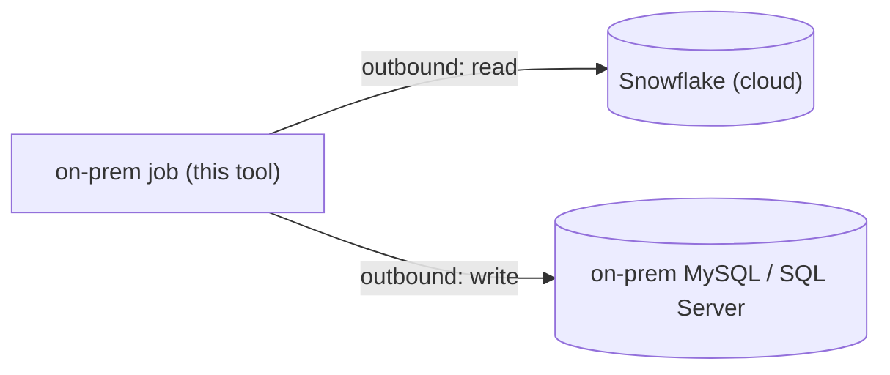
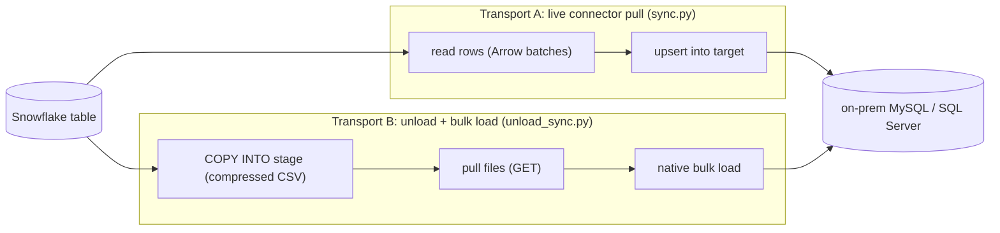

# SimpleReverseETL

[](LICENSE)
[](https://www.snowflake.com/)
[](https://www.python.org/)

A small, readable reference tool that **copies data out of Snowflake into an
on-premises MySQL or SQL Server database** on a schedule, using plain Python — no
ETL platform required. It shows two ways to do it and explains when to use each.

---

## New to Snowflake? Start here

**Snowflake** is a cloud data warehouse — a database that lives on the internet and
is very good at analytics over large tables. A common pattern is: raw data flows
*into* Snowflake, gets cleaned and modeled there, and the useful results need to go
back *out* to the systems people actually use day to day.

This project handles that "back out" step for one specific case: the destination is
a **regular SQL database running on-premises** (inside a company's own data center) —
MySQL or Microsoft SQL Server — that a business team already uses for reporting.

If you can run Python and reach Snowflake, you can use this. The included demo runs
entirely on your laptop with Docker.

## What is "reverse ETL", and why is this one different?

- **ETL** moves data *into* the warehouse (operational systems → Snowflake).
- **Reverse ETL** moves modeled data *out* of the warehouse into operational systems
  (Snowflake → CRM, marketing tools, or — as here — an operational MySQL/SQL Server).

The twist that makes this project necessary: most reverse-ETL tools are cloud-hosted
and **push** — they open a connection *into* your destination. An on-prem database
usually sits behind a corporate firewall that **blocks inbound connections from the
cloud**. So a hosted push tool often can't reach it.

This tool inverts that. **The job runs on-prem and makes only *outbound* connections**
— out to Snowflake to read, out to the local database to write. Corporate firewalls
routinely allow outbound and block inbound, so this is the shape that actually gets
approved in a locked-down network.



### A note on the Snowflake "DB-API"

Snowflake's Snowpark **`session.read.dbapi()`** reads *from* an external database
*into* Snowflake — the opposite direction from what we want, and there is no
`write.dbapi()` going the other way. So this tool does the natural thing instead:
read from Snowflake with the **Snowflake Connector for Python**, and write to the
target with that database's own driver (`pymysql` / `pyodbc`).

## Two ways it moves data (transports)

Both are on-prem-initiated and outbound. Pick per your data volume.



| | **Transport A** — connector pull (`sync.py`) | **Transport B** — unload + bulk load (`unload_sync.py`) |
|---|---|---|
| How | Streams rows over a live connection, upserts row-batches | Snowflake writes compressed files to a stage; on-prem pulls and bulk-loads them |
| Moving parts | Fewest | + a stage / object-storage bucket |
| Best for | Deltas and modest volume; simplicity | Large full loads (tens of millions of rows) |
| Load speed | Batched `executemany` | Native bulk load (`LOAD DATA` / `bcp`) — much faster at scale |
| Snowflake session | Held open during the whole load | Held only for the short unload; then decoupled |
| Restart / audit | Re-query on failure | Files are durable artifacts; re-load without re-querying |
| Firewall | on-prem → Snowflake (outbound) | on-prem → stage/bucket (outbound) — may not need Snowflake reachability at all |

## Quickstart: the 2-minute demo

Runs a local MySQL in Docker, seeds a table in Snowflake, then runs **both**
transports (a full load, then an incremental delta) and shows they produce the same
result.

**Prerequisites:** Docker Desktop running; a Snowflake account you can reach.

```bash
git clone https://github.com/sfc-gh-mwalli/simple-reverse-etl.git
cd simple-reverse-etl
cp demo/.env.demo.example demo/.env.demo   # then edit demo/.env.demo (see below)
./demo/run_demo.sh
```

Fill in `demo/.env.demo` with **one** of:
- `SF_CONNECTION_NAME` — the name of an entry in your `~/.snowflake/connections.toml`
  (simplest; no secrets in the file), or
- `SF_ACCOUNT` + `SF_PAT` — your account identifier and a Snowsight
  [Programmatic Access Token](https://docs.snowflake.com/en/user-guide/programmatic-access-tokens).

The demo talk-track and what each step shows is in [demo/README.md](demo/README.md).

## Using it for real

Configuration is environment variables (see [.env.example](.env.example) and
[config.py](config.py)). The two entry points share the same options:

```bash
# Transport A - full refresh of a table into MySQL
python sync.py --source ANALYTICS.DENTAL.DENTAL_CLAIMS --target DENTAL_CLAIMS \
    --change-capture none --mode truncate

# Transport A - incremental upsert on a modified-timestamp column
python sync.py --source ANALYTICS.DENTAL.DENTAL_CLAIMS --target DENTAL_CLAIMS \
    --change-capture hwm --hwm-col UPDATED_AT --mode upsert --key-cols CLAIM_ID

# Transport B - same delta, but via unload -> stage -> bulk load
python unload_sync.py --source ANALYTICS.DENTAL.DENTAL_CLAIMS --target DENTAL_CLAIMS \
    --change-capture hwm --hwm-col UPDATED_AT --mode upsert --key-cols CLAIM_ID
```

**Change-capture modes** (how it decides what to send):
- `none` — the whole table each run (pair with `--mode truncate`). Simple; fine for small/reference tables.
- `hwm` — only rows where a monotonic "high-water-mark" column (e.g. `UPDATED_AT`) advanced. Needs such a column; the last value is remembered in a small state file.
- `stream` (Transport A only) — Snowflake change data capture when there is *no* reliable timestamp column. See [sql/01_snowflake_setup.sql](sql/01_snowflake_setup.sql) for the one-time setup and the "outbox" pattern that makes it safe (at-least-once + idempotent upsert).

**Write modes:** `truncate` (wipe + reload) or `upsert` (merge on `--key-cols`).

**Targets:** `TARGET_KIND=mysql` or `mssql`. MySQL upsert uses
`INSERT ... ON DUPLICATE KEY UPDATE`; SQL Server uses a staging table + `MERGE`.

## Production notes

- **Authentication:** for an unattended scheduled job, use **key-pair (RSA)** auth
  (`SF_AUTH_METHOD=keypair`), the Snowflake standard for service accounts. PAT is fine
  for demos/short-lived use. Both are implemented in [snowflake_source.py](snowflake_source.py).
- **Transport B storage:** the demo unloads to the Snowflake **user stage** (`@~`) so it
  needs zero setup. In production, point `--stage` at an **external stage** over object
  storage your on-prem host can also reach (S3 / Azure Blob / GCS), for example:
  ```sql
  CREATE STAGE my_ext_stage
    URL='s3://my-bucket/exports/'
    STORAGE_INTEGRATION = my_s3_int
    FILE_FORMAT = (TYPE=CSV COMPRESSION=GZIP FIELD_OPTIONALLY_ENCLOSED_BY='"');
  ```
  On-prem then pulls with the cloud SDK/CLI instead of `GET`. With a shared bucket the
  on-prem side may not need any direct Snowflake connectivity at all.
- **Large volumes (tens of millions of rows):** prefer Transport B (parallel compressed
  unload + native bulk load), and prefer deltas (`hwm`/`stream`) over full reloads.
- **Secrets:** don't ship a real `.env`. Read credentials from your organization's
  approved secret store; the flat file is only for local convenience.
- **Scheduling:** there is no scheduler here on purpose — invoke `sync.py` /
  `unload_sync.py` as a step in whatever you already run (cron, Airflow, etc.).

## Repository layout

```
config.py             env-driven config (Snowflake + target)
snowflake_source.py   connect, batched Arrow read, unload/GET, stream helpers
targets.py            MySQL + SQL Server writers (upsert + bulk_load)
sync.py               Transport A CLI (live connector pull)
unload_sync.py        Transport B CLI (unload -> stage -> bulk load)
sql/                  one-time Snowflake setup for the stream/CDC path
demo/                 self-contained Docker + Snowflake demo of both transports
```

## License

MIT — see [LICENSE](LICENSE). Third-party components and their licenses are listed in
[NOTICE](NOTICE).

Contributions are not accepted — see [CONTRIBUTING.md](CONTRIBUTING.md). To report a
security issue, see [SECURITY.md](SECURITY.md).

## Disclaimer

THIS SOFTWARE IS PROVIDED "AS IS", WITHOUT WARRANTY OF ANY KIND, EXPRESS OR IMPLIED.

This is not an official Snowflake product or offering. It is an independent
demonstration built on Snowflake's documented features, and it is not endorsed,
supported, or maintained by Snowflake Inc. Running it consumes compute in your own
account. Use at your own risk.
